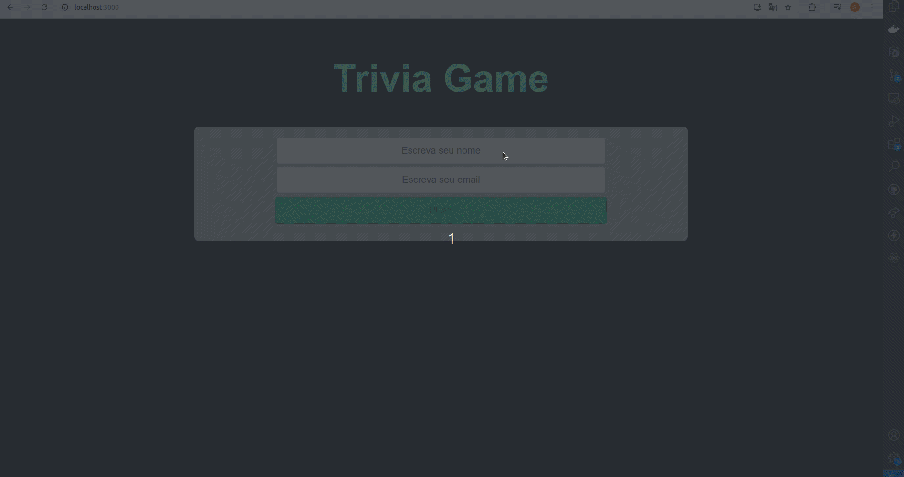

# # Project Trivia 


## 🌐 [](https://github.com/SamuelRocha91/trivia_game/blob/main/README.md) [](https://github.com/SamuelRocha91/trivia_game/blob/main/README_es.md) [](https://github.com/SamuelRocha91/trivia_game/blob/main/README_en.md) [](https://github.com/SamuelRocha91/trivia_game/blob/main/README_ru.md) [](https://github.com/SamuelRocha91/trivia_game/blob/main/README_ch.md) [](https://github.com/SamuelRocha91/trivia_game/blob/main/README_ar.md)



Este projeto foi desenvolvido como parte do módulo de Front-End do curso de Desenvolvimento Web da [Trybe](https://www.betrybe.com/). Trata-se de um jogo de perguntas e respostas baseado no jogo **Trivia**, desenvolvido utilizando **React** e **Redux**. A aplicação consome uma API externa para obter as perguntas e apresenta um sistema de timer e pontuação baseado no nível de dificuldade das perguntas.

## Sumário

- [Descrição](#descrição)
- [Tecnologias Utilizadas](#tecnologias-utilizadas)
- [Funcionalidades](#funcionalidades)
- [Instalação](#instalação)
- [Como Usar](#como-usar)
- [Executando com Docker](#executando-com-docker)
- [Metodologias Ágeis](#metodologias-ágeis)

## Descrição

O objetivo do projeto é proporcionar uma experiência interativa e divertida para os usuários ao responderem perguntas de diferentes níveis de dificuldade. A aplicação utiliza:

- **React** para o desenvolvimento dos componentes e páginas.
- **Redux** para o gerenciamento de estado global.
- **React Router** para a navegação entre as páginas do jogo, como tela de login, game, ranking, e feedback.

O sistema inclui:

- Uma interface de jogo com perguntas aleatórias.
- Temporizador para responder às perguntas.
- Sistema de pontuação baseado no tempo restante e na dificuldade da pergunta.
- Integração com a API [Open Trivia Database](https://opentdb.com/).

## Tecnologias Utilizadas

- **JavaScript** (ES6+)
- **React**
- **Redux**
- **React Router**
- **CSS**
- **HTML**
- **Docker** (para containerização da aplicação)

## Funcionalidades

1. **Perguntas Aleatórias**: A aplicação obtém perguntas da API externa [Open Trivia Database](https://opentdb.com/), mostrando uma pergunta de cada vez.
2. **Sistema de Timer**: O usuário tem 30 segundos para responder a cada pergunta. O botão de resposta é desativado ao término do tempo.
3. **Pontuação**: A pontuação é calculada com base no tempo restante e na dificuldade da pergunta.
4. **Sistema de Feedback**: Após responder todas as perguntas, o jogador é direcionado para a página de feedback.
5. **Ranking**: O jogador pode visualizar um ranking com as pontuações mais altas.
6. **Token de Acesso**: Para jogar, o usuário precisa de um token, gerado ao iniciar o jogo.

## Instalação

### Requisitos

- **Node.js** (versão 14 ou superior)
- **Docker** (opcional, se desejar rodar a aplicação em container)

### Passos para Instalação Local

1. Clone o repositório:
   ```bash
   git clone https://github.com/seu-usuario/trivia.git
   ```
2. Entre no diretório do projeto:
   ```bash
   cd trivia
   ```
3. Instale as dependências:
   ```bash
   npm install
   ```

4. Inicie a aplicação:
   ```bash
   npm start
   ```

A aplicação será executada em `http://localhost:3000`.

## Como Usar

1. Ao iniciar a aplicação, faça login ou gere um token de acesso.
2. Escolha uma categoria de perguntas e inicie o jogo.
3. Responda às perguntas dentro do tempo limite.
4. Ao final do jogo, você será redirecionado para a página de feedback e poderá ver sua pontuação.
5. Verifique o ranking dos melhores jogadores.

## Executando com Docker

Para executar a aplicação usando Docker, siga os passos abaixo:

1. Certifique-se de que o Docker está instalado em seu sistema.
2. No diretório raiz do projeto, execute o seguinte comando para construir a imagem Docker:
   ```bash
   docker build -t trivia-game .
   ```
3. Após a construção da imagem, inicie o container com o seguinte comando:
   ```bash
   docker run -p 3000:3000 trivia-game
   ```

A aplicação estará disponível em `http://localhost:3000`.

## Metodologias Ágeis

Durante o desenvolvimento do projeto, utilizamos metodologias ágeis para garantir uma organização eficiente do time e do fluxo de trabalho. As principais ferramentas e práticas utilizadas foram:

- **Trello**: Para gestão das tarefas e acompanhamento do progresso.
- **Scrum**: Com sprints semanais e reuniões diárias para alinhar as entregas e melhorar a comunicação entre a equipe.

## Outros projetos

- ⚽ [Typescript FootBall API](https://github.com/SamuelRocha91/trybeFutebolClube)
- 🐉 [Trybers and Dragons](https://github.com/SamuelRocha91/trybeAndDragons)
- 🌶️ [Recipes App](https://github.com/SamuelRocha91/ProjectRecipesApp)
- 🪧 [Blogs Api](https://github.com/SamuelRocha91/BlogsApi)
- 🗡️ [Trybe Smith](https://github.com/SamuelRocha91/TrybeSmith)
- 🐣 [Pokedex](https://github.com/SamuelRocha91/pokedex)
- 🏪 [FrontEnd Online Store](https://github.com/SamuelRocha91/project-frontend-online-store)
- 👛 [Expense organizer](https://github.com/SamuelRocha91/project-trybewallet)