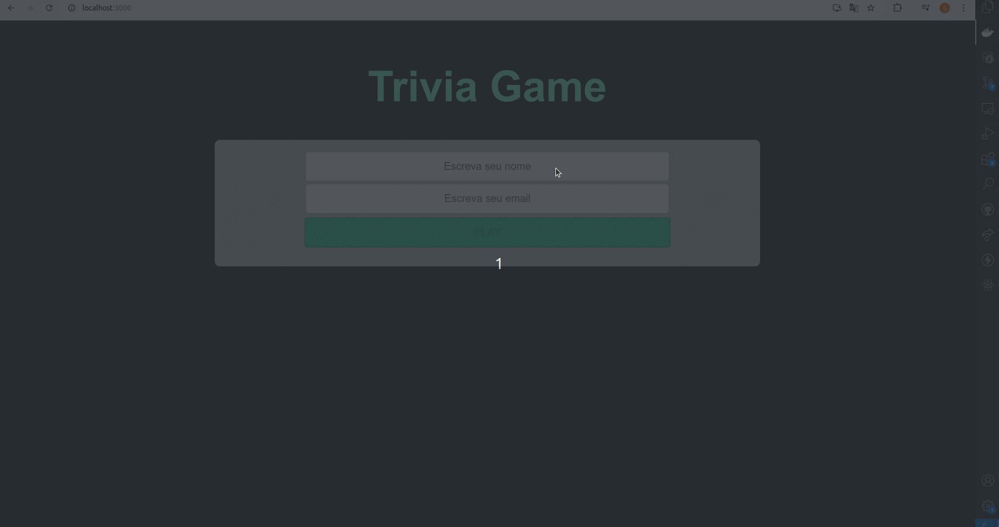

#  Project Trivia 

## üåê [](https://github.com/SamuelRocha91/trivia_game/blob/main/README.md) [](https://github.com/SamuelRocha91/trivia_game/blob/main/README_es.md) [](https://github.com/SamuelRocha91/trivia_game/blob/main/README_en.md) [](https://github.com/SamuelRocha91/trivia_game/blob/main/README_ru.md) [](https://github.com/SamuelRocha91/trivia_game/blob/main/README_ch.md) [](https://github.com/SamuelRocha91/trivia_game/blob/main/README_ar.md)



This project was developed as part of the Front-End module of the Web Development course at [Trybe](https://www.betrybe.com/). It is a trivia quiz game developed using **React** and **Redux**. The application consumes an external API to obtain questions and features a timer and scoring system based on the difficulty level of the questions.

<details>
  <summary><h2>📑 Summary</h2></summary>

  - [Description](#description)
  - [Technologies Used](#technologies-used)
  - [Features](#features)
  - [Installation](#installation)
  - [How to Use](#how-to-use)
  - [Running with Docker](#running-with-docker)
  - [Agile Methodologies](#agile-methodologies)

</details>

<details>
  <summary><h2>📝 Description</h2></summary>

  The goal of the project is to provide an interactive and fun experience for users answering questions of varying difficulty levels. The application uses:

  - **React** for developing components and pages.
  - **Redux** for global state management.
  - **React Router** for navigation between game pages, such as login screen, game, ranking, and feedback.

  The system includes:

  - A game interface with random questions.
  - A timer for answering questions.
  - A scoring system based on the remaining time and question difficulty.
  - Integration with the [Open Trivia Database](https://opentdb.com/) API.

</details>

<details>
  <summary><h2>🛠️ Technologies Used</h2></summary>

  - **JavaScript** (ES6+)
  - **React**
  - **Redux**
  - **React Router**
  - **CSS**
  - **HTML**
  - **Docker** (for containerizing the application)

</details>

<details>
  <summary><h2>⚙️ Features</h2></summary>

  1. **Random Questions**: The application fetches questions from the external [Open Trivia Database](https://opentdb.com/), showing one question at a time.
  2. **Timer System**: The user has 30 seconds to answer each question. The answer button is disabled once time is up.
  3. **Scoring**: The score is calculated based on the remaining time and question difficulty.
  4. **Feedback System**: After answering all questions, the player is redirected to the feedback page.
  5. **Ranking**: The player can view a ranking of the highest scores.
  6. **Access Token**: To play, the user needs a token generated at the start of the game.

</details>

<details>
  <summary><h2>📦 Installation</h2></summary>

  ### Requirements

  - **Node.js** (version 14 or higher)
  - **Docker** (optional, if you want to run the application in a container)

  ### Steps for Local Installation

  1. Clone the repository:
     ```bash
     git clone https://github.com/SamuelRocha91/trivia.git
     ```
  2. Navigate to the project directory:
     ```bash
     cd trivia
     ```
  3. Install the dependencies:
     ```bash
     npm install
     ```
  4. Start the application:
     ```bash
     npm start
     ```

  The application will run at `http://localhost:3000`.

</details>

<details>
  <summary><h2>🚀 How to Use</h2></summary>

  1. When starting the application, log in or generate an access token.
  2. Choose a category of questions and start the game.
  3. Answer the questions within the time limit.
  4. At the end of the game, you will be redirected to the feedback page to see your score.
  5. Check the ranking of top players.

</details>

<details>
  <summary><h2>🐳 Running with Docker</h2></summary>

  To run the application using Docker, follow these steps:

  1. Ensure that Docker is installed on your system.
  2. In the root directory of the project, run the following command to build the Docker image:
     ```bash
     docker build -t trivia-game .
     ```
  3. After building the image, start the container with the following command:
     ```bash
     docker run -p 3000:3000 trivia-game
     ```

  The application will be available at `http://localhost:3000`.

</details>

<details>
  <summary><h2>📊 Agile Methodologies</h2></summary>

  During the development of the project, we utilized agile methodologies to ensure efficient team organization and workflow. The main tools and practices used were:

  - **Trello**: For task management and progress tracking.
  - **Scrum**: With weekly sprints and daily meetings to align deliveries and improve communication within the team.

</details>

<details>
  <summary><h2>🔗 Other Projects</h2></summary>

  - 🌶️ [Recipes App](https://github.com/SamuelRocha91/ProjectRecipesApp/blob/main/README_en.md)
  - 🐣 [Pokedex](https://github.com/SamuelRocha91/pokedex/blob/main/README_en.md)
  - 🏪 [FrontEnd Online Store](https://github.com/SamuelRocha91/project-frontend-online-store/blob/main/README_en.md)
  - 👛 [Expense Organizer](https://github.com/SamuelRocha91/project-trybewallet/blob/main/README_en.md)

</details>